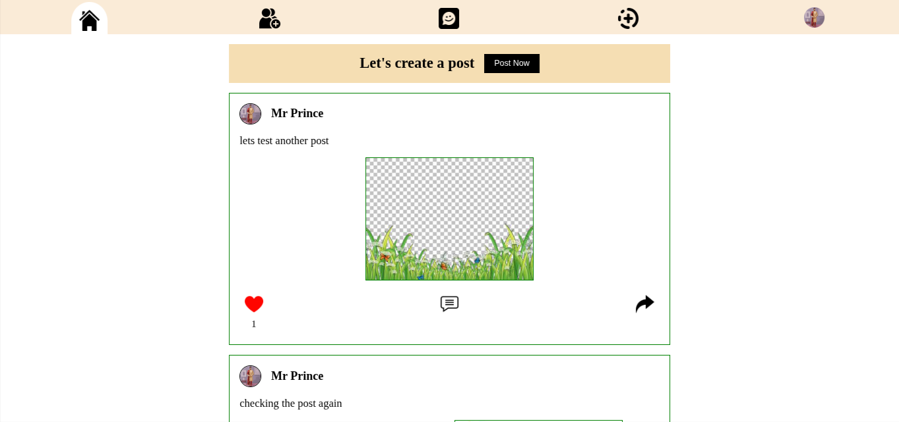
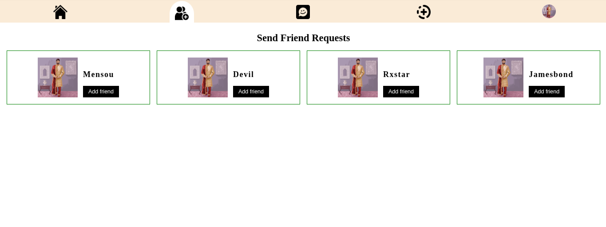
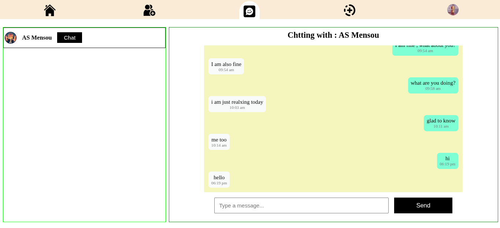

# 🗨️ Social Chat App

A full-stack social chat application where users can sign in using Google, send & accept friend requests, chat in real time, and post/like content — built with React, Node.js, MongoDB, and Socket.IO.

---

## 🚀 Live Demo

🌐 [View Live App](#) *(not deployed yet)*

---

## 🛠️ Tech Stack

**Frontend:**  
- React  
- React Router
- Redux 
- Axios  

**Backend:**  
- Node.js  
- Express  
- MongoDB (Mongoose)  
- Socket.IO  
- Passport.js (for Google OAuth)

---

## ✨ Features

- 🔐 Google login with OAuth
- 🧑‍🤝‍🧑 Send and accept friend requests
- 💬 Real-time chat between users
- 📝 Create posts and see friends' posts
- ❤️ Like and interact with posts
- 🖥️ Responsive UI

---

## 📷 Screenshots

### 🔐 📝 Post and Like Feed

---

### 🧑‍🤝‍🧑 Friend Request System

---

### 💬 Real-Time Chat

---

